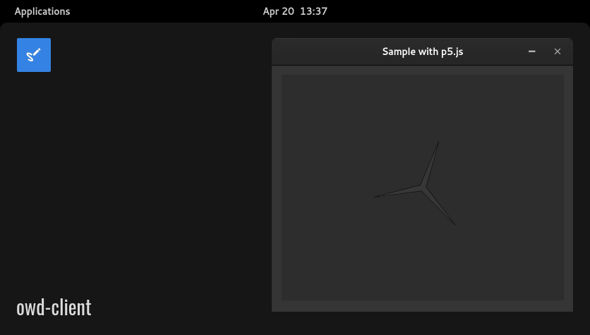

# p5.js boilerplate for OWD Client
> Start to draw on a canvas element with p5.js

<p>
    
</p>

<p>
    <a href="LICENSE"></a>
    <a href="https://github.com/owdproject/owd-client"></a>
    <a href="https://github.com/topics/owd-modules"></a>
    <a href="https://hacklover.net/patreon"></a>
    <a href="https://hacklover.net/discord"></a>
</p>

## Quick install
- Move to your client folder, then
  ```
  # Enter modules app directory
  cd src/modules/app/
  
  # Clone this repository
  git clone https://github.com/hacklover/owd-app-p5-boilerplate p5-boilerplate
  
  # Install dependencies using Yarn, or Npm
  yarn add p5
  npm install p5
  ```
- Define this module in `owd-client/client.extensions.ts`
  ```js
  import AboutModule from "@owd-client/core/src/modules/app/about";
  import DebugModule from "@owd-client/core/src/modules/app/debug";
  import P5BoilerplateModule from "~/modules/app/p5-boilerplate/client";

  export default {
    app: {
      modules: [
        AboutModule,
        DebugModule,
        P5BoilerplateModule,
      ]
    },
    ...
  ```
- Add this code to `owd-client/vite.config.ts`
  ```
  optimizeDeps: {
    include: ['p5']
  }
  ```

## Dependencies
- p5

## Compatibility
- Open Web Desktop client v2.0.0-beta.1

## License
This project is released under the [MIT License](LICENSE)